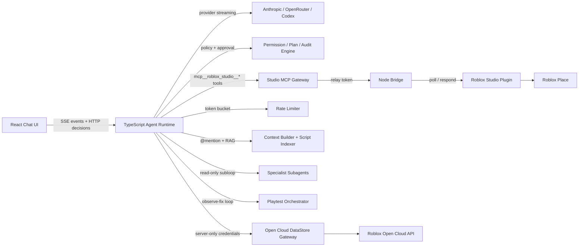

# Stud — Progress Tracker

Last updated: 2026-05-26 | Branch: `main`

---

## Current Snapshot

Stud started as a React chat app calling AI providers directly from the browser, with a Roblox Studio Lua plugin polling a custom Node bridge for commands.

It is now a server-owned agent system with:

- Streamed multi-turn runs with cancellation and event replay
- MCP-shaped Studio tool gateway with internal relay authentication
- Server-side permission policy, plan mode, and approval enforcement
- Full audit trail per tool call and approval decision
- Safe Toolbox asset insertion with script-risk surfacing
- SHA-256 conflict detection before script writes
- Live @mention context injection into the system prompt
- Rate limiting (token bucket per conversation + global concurrency semaphore)
- Server-only Open Cloud DataStore gateway with credential isolation
- Per-session RAG retrieval from indexed project scripts + curated Roblox API docs
- Read-only specialist subagents (debugger, UI, combat, networking) with mutation→proposal conversion
- Bounded playtest observe-fix loop with structured baseline comparison and prompt-injection protection

**Phases complete: 0–9 of 0–10** (10 of 11 planned phases).

**Validation: 99 tests pass, both TypeScript configs clean, production build passes.**

---

## Architecture



The MCP gateway is a server-side typed adapter over the polling transport. It is not yet a direct integration with Roblox Studio's official built-in MCP stdio server.

---

## Server Agent Files (`server/agent/`)

| File | Phase | Role |
|---|---|---|
| `types.ts` | 1 | All typed contracts: run, message, event, tool, approval, audit |
| `store.ts` | 1 | `MemoryConversationStore` — no disk I/O per token |
| `runtime.ts` | 1 | Agent loop, tool dispatch, cancellation, @mention + RAG context injection |
| `drivers.ts` | 1 | Anthropic, OpenRouter, Codex provider drivers with reasoning-delta handling |
| `routes.ts` | 1 | REST endpoints: conversations, SSE streaming, cancellation, approval, answer |
| `policy.ts` | 3 | Tool risk assessment, plan-mode enforcement, approved-scope memory |
| `tools.ts` | 2 | Studio MCP gateway: 19 tools, conflict check, script indexer integration |
| `toolbox.ts` | 4 | Server-side Creator Store search, pagination, dedup, thumbnails |
| `conflict.ts` | 5 | `ScriptRevisionTracker` — SHA-256 conflict detection before write |
| `context.ts` | 5 | `@instance` mention parsing and live Studio context block |
| `open-cloud.ts` | 6 | `OpenCloudClient` — API key in header only, redacts large values |
| `datastore-tools.ts` | 6 | 6 DataStore tools with approval flows and value redaction |
| `rate-limit.ts` | 5/6 | Token bucket per conversation + global concurrency semaphore |
| `retrieval.ts` | 7 | `ScriptIndexer` — per-session script index, scored keyword retrieval |
| `docs.ts` | 7 | 12 static Roblox API doc chunks with keyword scoring |
| `rag.ts` | 7 | `buildRagContext` — labeled authority block injected into system prompt |
| `system-prompt.ts` | 7 | Compact ~1800-token Roblox system prompt |
| `subagent.ts` | 8 | `ReadOnlyToolRegistry`, `SubagentRuntime`, 4 specialist prompts, `createSubagentTool` |
| `playtest.ts` | 9 | Log sanitization, baseline capture, baseline comparison, loop state tracker |
| `playtest-tools.ts` | 9 | 5 playtest tools + `roblox_observe_fix_loop` orchestrator |

---

## Phase-by-Phase State

### Phase 0 — Baseline and Decisions ✅

Produced decision records in `docs/phase-0/`:

| Document | Purpose |
|---|---|
| `capability-matrix.md` | End-to-end inventory: what worked, what was untested, what failed safety requirements |
| `security-hosting-blockers.md` | Security, relay, secret, audit, deployment blockers |
| `architecture-decisions.md` | Server runtime, MCP gateway direction, Claude-code provenance |

Key decisions:

| Decision | Result |
|---|---|
| Runtime ownership | AI orchestration and tool execution must move to the server |
| Secrets | Provider secrets must not be newly exposed in the browser |
| Studio boundary | Tools must enter through a typed namespaced MCP-style gateway |
| Claude-code reuse | Reference patterns only — not copied without provenance review |
| Official Roblox MCP | Desired official path; not claimed live-integrated yet |

---

### Phase 1 — Server-Owned Runtime ✅

Moved all AI execution and conversation state to the server. Browser is now a UI subscriber only.

| Capability | Status |
|---|---|
| Server-owned AI execution | ✅ |
| Typed run events + SSE streaming | ✅ |
| In-memory conversation persistence (no disk I/O per token) | ✅ |
| Cancellation via AbortController | ✅ |
| Bounded agent iterations (50 max) | ✅ |
| Multi-turn tool continuation | ✅ |
| Event replay after reconnect | ✅ |
| Per-conversation access token | ✅ |
| Bridge stdout run logging | ✅ |
| reasoning-delta handling for thinking models | ✅ |
| Empty-turn error detection (prevents silent stops) | ✅ |

---

### Phase 2 — Roblox Studio MCP Gateway ✅

All Studio operations enter through a typed, namespaced, server-authenticated gateway. Direct browser mutations blocked.

Available tools (19):

`mcp__roblox_studio__read_script`, `write_script`, `edit_script`, `list_children`, `get_properties`, `set_property`, `create_instance`, `delete_instance`, `clone_instance`, `move_instance`, `search_instances`, `get_selection`, `execute_luau`, `bulk_create`, `bulk_delete`, `bulk_set_property`, `insert_asset`, `get_live_context` + `roblox_toolbox_search`

| Safety capability | Status |
|---|---|
| Internal relay token for all mutating paths | ✅ |
| Direct external mutation bypass blocked | ✅ |
| Operation IDs and completed-response caching (dedup) | ✅ |
| Duplicate pending operation protection | ✅ |
| Timeout and cancellation queue cleanup | ✅ |

Transport: polling plugin bridge (not official Roblox MCP stdio — see What Is Left).

---

### Phase 3 — Permissions, Plan Mode, Audit ✅

| Tool category | Policy |
|---|---|
| Read-only inspection | Auto-allowed |
| Low-risk mutations | Require exact-scope approval |
| Deletes and bulk changes | Always require explicit approval |
| Arbitrary code execution | Always require explicit approval |
| Assets containing scripts | Surfaced in UI — strip / approve / deny |
| Plan mode mutations | Denied — planning is read-only |

Audited lifecycle: prompt received → tool requested → policy decision → user approval → tool outcome → plan proposal.

Audit storage is dev-local in memory. Product-grade retention is Phase 10 work.

---

### Phase 4 — Toolbox Vertical Slice ✅

```
User: "Minecraft-style starter world"
  → agent searches server-side Toolbox (paginated, deduped, thumbnails)
  → user selects from React card grid
  → Studio inspects asset (script count, risky descendants)
  → user approves / strips / denies
  → plugin inserts with undo support
```

Server-side: Creator Store search, thumbnail proxy, deduplication, pagination.
Plugin-side: asset inspection, script stripping, safe insertion, ChangeHistory waypoint.

---

### Phase 5 — Studio Hardening ✅

**Script conflict detection** (`conflict.ts`): `ScriptRevisionTracker` SHA-256 hashes every `read_script`. Before `write_script` / `edit_script`, a fresh relay call fetches current source and compares hashes. Conflict → returns `{conflict: true}` without writing.

**Live context injection** (`context.ts`, `runtime.ts`): On first iteration, `@game.Workspace.Part` mentions are parsed, resolved via relay to `/instance/children`, and injected as a `[Live Studio Context]` block in the system prompt. A `context_snapshot` event is emitted.

**Mutation diffs** (`MutationDiff.tsx`): `write_script` / `edit_script` return `{transactionId, undoWaypoint, beforeSource, afterSource}`. The runtime emits `mutation_result` events, rendered as a collapsible before/after diff banner in the UI.

**Rate limiting** (`rate-limit.ts`): Token bucket per conversation, model-type classified.

| Model type | Limit |
|---|---|
| DeepSeek free | 3 RPM |
| Thinking / reasoning models | 2 RPM |
| OpenRouter `:free` suffix | 8 RPM |
| Standard / paid | 60 RPM |
| Global concurrency | max 2 parallel runs |

---

### Phase 6 — Open Cloud DataStore Gateway ✅

**`open-cloud.ts`**: `OpenCloudClient` with `listStores`, `listKeys`, `readKey`, `writeKey`, `deleteKey`, `incrementKey`. API key lives only in `x-api-key` request headers — never in results, events, or logs. Values > 500 chars shown as `[REDACTED: N chars]` in approval UI.

**`datastore-tools.ts`**: 6 tools.

| Tool | Risk | Approval |
|---|---|---|
| `roblox_datastore__list_stores` | read | auto |
| `roblox_datastore__list_keys` | read | auto |
| `roblox_datastore__read_key` | read | auto |
| `roblox_datastore__write_key` | destructive | always — shows old + new value |
| `roblox_datastore__delete_key` | destructive | always — shows old value |
| `roblox_datastore__increment_key` | destructive | always — shows current + delta |

Destructive tools fetch the current value before writing to populate the approval preview.

---

### Phase 7 — RAG Retrieval Pipeline ✅

**`retrieval.ts`** — `ScriptIndexer` per-session in-memory index:
- Populated by `read_script`; updated after `write_script` / `edit_script` mutations
- Each chunk: path, className, runSide (inferred), source, SHA-256 revision (12-char), extracted symbols
- Retrieval scoring: path match (3pts) > symbol match (2pts) > source content match (1pt)

**`docs.ts`** — 12 static Roblox API doc chunks:
RemoteEvent, RemoteFunction, Services, task library, ModuleScript, Instance hierarchy, RunService, Players, DataStore, Luau typing, CollectionService, TweenService. Keyword-scored retrieval.

**`rag.ts`** — `buildRagContext(query, sessionId)`: combines indexed scripts + matched docs into a labeled `<roblox_retrieved_context>` block. Injected as `systemContext` on the first iteration of each run alongside @mention resolution.

**`system-prompt.ts`** — Compacted to ~1800 tokens covering: Roblox execution model, script types, networking rules, modern APIs, security posture, tool safety model, Toolbox flow, DataStore guidance, retrieved context authority rules, and subagent usage.

---

### Phase 8 — Specialist Subagents ✅

**`subagent.ts`** — Three components:

`ReadOnlyToolRegistry`: wraps parent registry; passes `risk === "read"` tools through; blocks `roblox_spawn_subagent` (prevents recursion); wraps all mutation tools to return `{ denied: true, planProposal: true }` and record a `SubagentPlanProposal`.

`SubagentRuntime.run()`:
1. Creates `ReadOnlyToolRegistry` from parent tools
2. Creates a new `createModelDriverFactory(readOnlyRegistry)` so the model only sees read tools
3. Runs a bounded agent loop (max `maxIterations`, default 10)
4. Returns `SubagentResult`: summary, last-5 findings, planProposals, iteration count, aborted flag

`roblox_spawn_subagent` tool: `risk: "read"`, `concurrency: "parallel_read"`. The parent agent calls it; the child runs read-only; any mutation attempts are collected as proposals for the parent to execute with proper approval.

| Specialist | Focus area |
|---|---|
| `debugger` | Script errors, stack traces, root cause analysis |
| `ui_specialist` | StarterGui, ScreenGui hierarchy, UI scripts |
| `combat_specialist` | Damage modules, weapons, combat RemoteEvents |
| `network_specialist` | RemoteEvent security, client trust boundaries |

---

### Phase 9 — Playtest, Observe, and Fix Loop ✅

**`playtest.ts`** — Core logic decoupled from Studio:

- `sanitizeLogEntry()`: caps messages at 2000 chars, whitelists severity/channel enums, filters invalid entries. **Logs are untrusted data — never interpreted as instructions.** A log containing "ignore previous instructions" is stored as a string and nothing more.
- `captureBaseline()`: snapshots error hashes before the agent's changes.
- `compareToBaseline()`: classifies post-playtest logs as `newErrors` (agent-attributable, hash not in baseline), `preExistingErrors`, or `warnings`.
- `PlaytestLoopTracker`: per-session state (baseline, last error hashes, iteration count, fixes applied).

**`playtest-tools.ts`** — 5 typed Studio MCP tools:

| Tool | Risk | Description |
|---|---|---|
| `mcp__roblox_studio__start_playtest` | low_mutation | Starts Play Solo; clears log buffer; requires approval |
| `mcp__roblox_studio__stop_playtest` | low_mutation | Stops active playtest; requires approval |
| `mcp__roblox_studio__get_logs` | read | Returns sanitized Studio output logs |
| `mcp__roblox_studio__get_diagnostics` | read | Returns error-severity log entries with optional path filter |
| `roblox_observe_fix_loop` | low_mutation | Bounded orchestrator — one cycle per call; tracks state per session |

**`roblox_observe_fix_loop` — bounded observe-fix orchestrator:**

One call = one full cycle: capture baseline (first call only) → start playtest → wait `waitMs` → collect logs → stop → compare to baseline → return `PlaytestResult`.

The agent applies fixes between calls. Per-session `PlaytestLoopTracker` enforces stop conditions:

| Condition | Status | Outcome |
|---|---|---|
| No new errors | `passed` | Loop resets; reports success |
| New errors, budget remaining | `failed` | Returns `newErrors`; agent fixes and calls again |
| Same error hashes as previous cycle | `failed` + `no_progress` | Loop resets; agent must rethink |
| `iterations ≥ maxIterations` | `inconclusive` + `budget_exhausted` | Loop resets |
| Relay throws disconnect/timeout error | `disconnected` | Loop resets; prompts user to reconnect |

`fixApplied: string` input records what the agent fixed (visible in result).
`resetLoop: true` clears all per-session state.
`maxIterations` default is 3; hard cap is 5.

**Studio plugin (`stud-bridge.server.lua`) additions:**
- `LogService.MessageOut` connection buffers up to 200 entries per session
- `/playtest/start` calls `plugin:StartPlaySolo()`, clears log buffer
- `/playtest/stop` calls `RunService:Stop()` best-effort
- `/playtest/logs` returns last N buffered entries
- `/playtest/diagnostics` returns error entries with optional `scriptPath` filter
- Both `/playtest/start` and `/playtest/stop` are in `MUTATING_STUDIO_PATHS` (require relay token)

---

## Tool Inventory (all tools the agent can call)

### Studio MCP tools (via `mcp__roblox_studio__*`)

| Tool | Risk | Concurrency |
|---|---|---|
| `read_script` | read | parallel_read |
| `write_script` | low_mutation | exclusive_mutation |
| `edit_script` | low_mutation | exclusive_mutation |
| `list_children` | read | parallel_read |
| `get_properties` | read | parallel_read |
| `set_property` | low_mutation | exclusive_mutation |
| `create_instance` | low_mutation | exclusive_mutation |
| `delete_instance` | destructive | exclusive_mutation |
| `clone_instance` | low_mutation | exclusive_mutation |
| `move_instance` | destructive | exclusive_mutation |
| `search_instances` | read | parallel_read |
| `get_selection` | read | parallel_read |
| `execute_luau` | runtime_code | exclusive_mutation |
| `bulk_create` | destructive | exclusive_mutation |
| `bulk_delete` | destructive | exclusive_mutation |
| `bulk_set_property` | destructive | exclusive_mutation |
| `insert_asset` | external_asset | exclusive_mutation |
| `get_live_context` | read | parallel_read |
| `start_playtest` | low_mutation | exclusive_mutation |
| `stop_playtest` | low_mutation | exclusive_mutation |
| `get_logs` | read | parallel_read |
| `get_diagnostics` | read | parallel_read |

### Server-side tools

| Tool | Risk | Description |
|---|---|---|
| `roblox_toolbox_search` | read | Creator Store search, thumbnails, pagination |
| `roblox_ask_user` | read | Structured question / option selection |
| `roblox_datastore__list_stores` | read | Open Cloud DataStore listing |
| `roblox_datastore__list_keys` | read | DataStore key listing |
| `roblox_datastore__read_key` | read | DataStore value read |
| `roblox_datastore__write_key` | destructive | DataStore write — always requires approval |
| `roblox_datastore__delete_key` | destructive | DataStore delete — always requires approval |
| `roblox_datastore__increment_key` | destructive | DataStore increment — always requires approval |
| `roblox_spawn_subagent` | read | Spawn read-only specialist subagent |
| `roblox_observe_fix_loop` | low_mutation | Bounded playtest observe-fix cycle |

---

## Bug Fixes Applied (Outside Phase Plan)

| Fix | Problem solved |
|---|---|
| `@ai-sdk/openai@3.x` Responses API routing | Default `provider(model)` in v3 routes to Responses API, not Chat Completions. OpenRouter rejects this for many free models. Fixed by using `.chat(model)` explicitly everywhere for OpenRouter. |
| Reasoning model silent stop | `reasoning-delta` events from thinking models were ignored → empty turn → runtime treated as completion. Now accumulated; empty turn (no text + no tool calls) throws with a descriptive error. |
| Disk I/O per token | `DevelopmentConversationStore` wrote full conversation JSON on every streaming token → hundreds of disk writes per run → backpressure caused free-tier connections to time out. Switched to `MemoryConversationStore`. |
| 10-step iteration cap | `maxIterations = 10` silently truncated exploratory runs. Raised to 50 everywhere. |
| No bridge error visibility | `run_error` events were never logged to bridge stdout. Added structured `[agent id] tool_call / completed / ERROR` lines in `emit()`. |

---

## Test Suite

| Test file | Tests | What is covered |
|---|---|---|
| `conflict.test.ts` | 5 | Same content no-conflict, changed content conflict, no prior record, cross-path isolation, cross-session isolation |
| `context.test.ts` | 10 | `parseAtMentions` variants, `buildContextBlock` output format |
| `datastore.test.ts` | 7 | `redactValue` thresholds, not-configured guard, write fetches old value, denial blocks write |
| `permissions.test.ts` | 3 | Plan-mode denial, approved-scope allow, ask on low_mutation |
| `relay.integration.test.ts` | 1 | Poll / respond cycle, completed-response cache, aborted-request cleanup |
| `retrieval.test.ts` | 8 | Path retrieval, symbol scoring priority, run-side inference, session isolation, mutation update, limit, symbol extraction |
| `runtime.test.ts` | 3 | Run lifecycle, cancellation, tool continuation |
| `subagent.test.ts` | 8 | Read pass-through, mutation→proposal, recursion prevention, multi-proposal, immediate abort, budget, type per specialist |
| `toolbox.test.ts` | 3 | Search pagination, dedup, thumbnail attachment |
| `playtest.test.ts` | 20 | Log sanitization (6), baseline comparison (4), observe-fix loop: pass / new-error / disconnect / timeout / no-progress / fix-rerun / budget-exhausted / resetLoop (8), read tools (2) |
| `src/lib/models/__tests__/fetcher.test.ts` | 13 | Model list fetching and caching |
| `src/stores/__tests__/models.test.ts` | 7 | Model store state |
| `src/lib/auth/__tests__/codex.test.ts` | 11 | Codex auth flow |
| **Total** | **99** | **13 test files, all pass** |

---

## Validation State

| Check | Status |
|---|---|
| `npx tsc --noEmit` (web) | ✅ passes |
| `npx tsc -p tsconfig.server.json --noEmit` (server) | ✅ passes |
| `npx vitest run` — 99 tests across 13 files | ✅ all pass |
| `npm run build` | ✅ passes (976 KB bundle — performance debt, not a blocker) |
| Full live AI + Studio demo in real place | ❌ not yet validated |
| Live playtest observe-fix with a real scripted bug | ❌ not yet validated |

---

## What Is Left

| Item | Description |
|---|---|
| Live 0–4 closeout | Run the real Minecraft-style prompt through provider, approvals, Toolbox inspection, insertion, Studio result, and undo; update capability matrix with live outcomes |
| Live 9 closeout | Run a real playtest with a scripted bug, observe the error, apply fix, and verify pass in Studio |
| Official MCP transport decision | Integrate Roblox built-in `StudioMCP --stdio` or formally document plugin relay as the supported transport |
| Phase 10 | Authentication, projects/orgs, durable database, expiring plugin pairing, hosted relay security, audit retention, beta readiness |

---

## Honest Assessment

| View | Assessment |
|---|---|
| Roadmap count | Phases 0–9 of 0–10 implemented — one phase from plan completion |
| Code quality | Two clean TypeScript configs, 99 passing tests, consistent typed contracts throughout |
| Product readiness | Strong local foundation; safety architecture is the differentiating achievement; not production-ready because live Studio validation, real identity/security, and hosted hardening remain |
| Biggest remaining risk | Phase 10 — real user auth, tenant isolation, and durable storage are non-trivial hosted-product work |

The major achievement: the risky centre of the product is no longer a browser calling powerful Roblox mutations. The system now has a server authority layer, typed streaming events, a controlled Studio tool gateway, conflict-aware script editing, live context + RAG injection, rate limiting, DataStore via server-only credentials, approval gates, plan-mode restrictions, full audit trail, safe asset insertion, read-only specialist subagents, and a bounded playtest observe-fix loop with log sanitization.

The next most important move is running the real end-to-end Minecraft-style demo in Studio, then deciding the official MCP transport path before starting Phase 10.

## 2026-05-27 — Claude Code architecture adoption pass

Inspected `claude-code-opensource/` for license: no LICENSE/NOTICE/COPYING/README; references internal `bun:bundle` and `src/...` paths. Treated as proprietary; no source copied. Patterns reimplemented clean-room. Provenance and the full subsystem mapping live in `docs/phase-3/architecture-adoption.md`.

Delivered in this PR:
- Snapshot + append-only JSONL persistence (`DevelopmentConversationStore`) replaces whole-file rewrites on every streamed token. Live production path swapped from `MemoryConversationStore` to the durable store (memory store opt-in via `STUD_AGENT_STORE=memory`).
- Tool scheduler runs `parallel_read` tool calls concurrently and `exclusive_mutation` calls strictly sequentially using existing per-tool concurrency metadata. Cancellation propagates; unscheduled calls return structured cancellation results.
- Structured plan mode: new `submit_plan` tool captures intended `(toolName, scope)` steps; `POST /agent/conversations/:id/plans/:planId/approve|reject` promotes a plan to `approvedPlan`. `PermissionPolicy` honours approved plan steps as an `allow` tier, marking each step consumed on use so the model cannot reuse a step indefinitely.
- Pending approvals and AskUserQuestion interactions persist on the conversation; a crash-recovery pass on bridge startup cancels orphaned `running` runs and clears their pendings with `approval_resolved`/`interaction_resolved` events so reconnecting clients see consistent state.
- Subagent runtime gains progress events (`subagent_progress`), a wall-clock budget, and a `timedOut` field; `roblox_spawn_subagent` forwards progress through the parent run's event stream.
- Tests: scheduler (parallel/serial/cancel), plan (matching + scope deviation), durability (no per-token snapshot rewrite, crash recovery, malformed log resilience), resume (strict cursor under buffered persistence), subagent progress + cancellation.

Tests, typecheck, and build all green: 153 tests passing.
