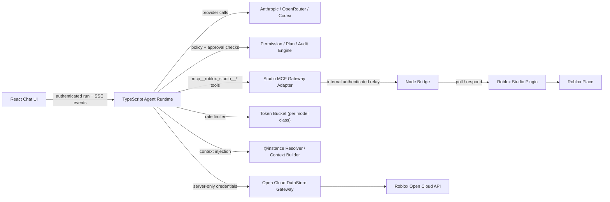

# Stud — Progress Tracker

Last updated: 2026-05-25 | Branch: `main`

---

## Current Snapshot

Stud started as a React chat app talking directly to AI providers and a custom Node bridge, with a Roblox Studio Lua plugin polling for commands.

It is now a server-owned agent system with streamed runs, cancellation, persisted conversations, MCP-shaped Studio tools, approval enforcement, plan mode, audit events, a safe Toolbox insertion path, script conflict detection, live context injection, rate limiting, and a server-only Open Cloud DataStore gateway.

**Phases complete: 0–8 of 0–10** (9 of 11 planned phases).

By product readiness: strong local foundation with safety architecture intact. Not yet production-ready — live Studio demo validation, real identity/security, and hosted hardening remain.

---

## Architecture



The MCP gateway is a server-side typed adapter over the working polling transport. It is not yet a direct live integration with Roblox Studio's official built-in MCP stdio server.

---

## Phase-by-Phase State

### Phase 0 — Baseline and Decisions ✅

Produced docs:

| Document | Purpose |
|---|---|
| `docs/phase-0/capability-matrix.md` | End-to-end inventory: what worked, what was untested, what failed safety requirements |
| `docs/phase-0/security-hosting-blockers.md` | Security, relay, secret, audit, deployment blockers |
| `docs/phase-0/architecture-decisions.md` | Server runtime, MCP gateway direction, Claude-code provenance |

Key decisions:

| Decision | Result |
|---|---|
| Runtime ownership | AI orchestration and tool execution must move to the server |
| Secrets | Provider secrets must not be newly exposed in the browser |
| Studio boundary | Tools must enter through a typed namespaced MCP-style gateway |
| Claude-code reuse | Reference patterns only — not copied without provenance review |
| Official Roblox MCP | Desired official path; not claimed live-integrated yet |

---

### Phase 1 — Server-Owned Runtime ✅

Core files:

| File | Role |
|---|---|
| `server/agent/types.ts` | Typed run, message, event, tool, approval, audit contracts |
| `server/agent/store.ts` | Development conversation and event persistence |
| `server/agent/runtime.ts` | Agent loop, tool continuation, cancellation, iteration bounds |
| `server/agent/drivers.ts` | Server-side AI provider drivers (Anthropic, OpenRouter, Codex) |
| `server/agent/routes.ts` | Conversation, streaming, cancellation, answer, approval endpoints |
| `src/lib/ai/server-agent.ts` | Browser client for the server runtime |
| `src/pages/Home.tsx` | React integration for streamed runs and interactions |

Implemented:

| Capability | Status |
|---|---|
| Server-owned AI execution | ✅ |
| Typed run events + SSE streaming | ✅ |
| Development conversation persistence | ✅ |
| Cancellation via AbortController | ✅ |
| Bounded agent iterations (50 max) | ✅ |
| Multi-turn tool continuation | ✅ |
| Event replay after reconnect | ✅ |
| Per-conversation access token | ✅ |
| Bridge stdout run logging | ✅ |
| reasoning-delta handling for thinking models | ✅ |
| Empty-turn error detection (prevents silent stops) | ✅ |
| MemoryConversationStore (no disk I/O per token) | ✅ |

Remaining production gaps:

| Gap | Priority |
|---|---|
| Real signed-in user identity | Phase 10 |
| Project ownership and tenant isolation | Phase 10 |
| Durable database storage | Phase 10 |
| Live end-to-end Studio run validation | Next action |

---

### Phase 2 — Roblox Studio MCP Gateway ✅

Core files:

| File | Role |
|---|---|
| `server/agent/tools.ts` | Namespaced Studio and Toolbox tool definitions |
| `server/index.js` | Internal relay protection, request queue, plugin exchange |
| `studio-plugin/stud-bridge.server.lua` | Studio operation execution in Lua |
| `docs/phase-2/roblox-studio-mcp-gateway.md` | Gateway design and limitations |

Available tools through the server boundary:

`mcp__roblox_studio__read_script`, `write_script`, `edit_script`, `list_children`, `get_properties`, `set_property`, `create_instance`, `delete_instance`, `clone_instance`, `move_instance`, `search_instances`, `get_selection`, `execute_luau`, `bulk_create`, `bulk_delete`, `bulk_set_property`, `insert_asset`, `get_live_context`

Safety and reliability:

| Capability | Status |
|---|---|
| Agent calls namespaced gateway (not browser tools) | ✅ |
| Internal authenticated relay for mutating requests | ✅ |
| Direct external mutation bypass blocked | ✅ |
| Operation IDs and completed-response caching | ✅ |
| Duplicate pending operation protection | ✅ |
| Timeout and cancellation queue cleanup | ✅ |

Transport note: MCP exists as the server tool contract and policy boundary. The underlying transport still uses the polling plugin bridge, not Roblox's official built-in MCP stdio.

---

### Phase 3 — Permissions, Plan Mode, Audit ✅

Core files:

| File | Role |
|---|---|
| `server/agent/policy.ts` | Tool risk metadata and policy decisions |
| `server/agent/runtime.ts` | Enforcement, approval waiting, audit emission |
| `src/components/chat/ApprovalPrompt.tsx` | Approval interaction UI |
| `docs/phase-3/permission-plan-audit.md` | Behavior and remaining hosting requirements |

Safety model:

| Tool category | Treatment |
|---|---|
| Read-only inspection | Allowed where policy permits |
| Low-risk mutations | Require exact-scope approval |
| Deletes and bulk changes | High risk, explicit approval required |
| Arbitrary code execution | High risk, explicit approval required |
| Assets containing scripts or risky descendants | Surfaced in UI; user chooses strip/approve/deny |
| Plan mode mutations | Denied — planning is read-only |

Audited lifecycle:

- User prompt received
- Tool requested
- Policy allow / ask / deny decision
- User approval or denial
- Tool result or failure
- Plan proposal

Audit storage is development-local JSON. Product-grade retention, user attribution, and tamper resistance are Phase 10 work.

---

### Phase 4 — Toolbox Vertical Slice ✅

Core files:

| File | Role |
|---|---|
| `server/agent/toolbox.ts` | Server-side Creator Store search, deduplication, pagination, thumbnails |
| `src/components/chat/QuestionPrompt.tsx` | Interactive selection UI (preserved, not rebuilt) |
| `src/components/chat/ApprovalPrompt.tsx` | Asset-risk approval choices |
| `studio-plugin/stud-bridge.server.lua` | Asset inspection and script stripping in Lua |
| `docs/phase-4/toolbox-demo.md` | Minecraft-style demo workflow |

Implemented flow:

```
User: "Minecraft-style starter world"
  → agent plans and searches server-side Toolbox
  → paginated deduplicated results with thumbnails shown in React
  → user selects asset
  → Studio inspects asset before insertion
  → scripts and risky descendants surfaced
  → user approves / denies / inserts without scripts
  → plugin inserts approved result with undo support
```

---

### Phase 5 — Studio Hardening ✅ (NEW)

Core files:

| File | Role |
|---|---|
| `server/agent/conflict.ts` | SHA-256 script revision tracking and conflict detection |
| `server/agent/context.ts` | `@instance` mention parsing and live context injection |
| `src/components/chat/MutationDiff.tsx` | Collapsible before/after diff banner (reuses `DiffView`) |

#### Script conflict detection (`conflict.ts`)

`ScriptRevisionTracker` SHA-256 hashes every `read_script` result. Before `write_script` or `edit_script` executes, it does a fresh `/script/get` relay call and compares against the stored hash. Conflict → returns `{conflict: true, reason, currentRevision}` without writing. After a successful write, the hash is updated.

#### Live context injection (`context.ts`, `runtime.ts`)

On the first iteration of each run:
1. `@game.Workspace.Part` mentions in the user message are parsed
2. Each path is resolved via `/instance/children` relay call
3. A compact `[Live Studio Context]` block is appended to the driver's system prompt
4. A `context_snapshot` event is emitted for observability

#### Structured mutation results

`write_script` and `edit_script` now return `{transactionId, undoWaypoint, beforeSource, afterSource}`. The runtime emits `mutation_result` events which flow to `MutationDiff.tsx` — a collapsible banner above the composer that uses the existing `DiffView` component.

#### Studio plugin additions

- `/script/get` response now includes a `revision` fingerprint (cheap length + head/tail hash)
- `/script/set` and `/script/edit` responses include `undoWaypoint` and updated `revision`
- `ChangeHistoryService:SetWaypoint()` called on both sides of each mutation

#### New tests

| Test file | Coverage |
|---|---|
| `server/agent/conflict.test.ts` | Same content (no conflict), different content (conflict), no prior record, cross-path and cross-session isolation — 5 tests |
| `server/agent/context.test.ts` | `parseAtMentions` variants, `buildContextBlock` output format — 10 tests |

---

### Phase 6 — Open Cloud DataStore Gateway ✅ (NEW)

Core files:

| File | Role |
|---|---|
| `server/agent/open-cloud.ts` | Open Cloud DataStore client (server-only) |
| `server/agent/datastore-tools.ts` | Six DataStore agent tools with approval flows |

#### Server-only client (`open-cloud.ts`)

`OpenCloudClient` with `listStores`, `listKeys`, `readKey`, `writeKey`, `deleteKey`, `incrementKey`. API key lives only in `Authorization` request headers — never in results, tool outputs, or logs. Values > 500 chars are redacted in audit and approval UI. Requires `ROBLOX_OPEN_CLOUD_API_KEY` + `ROBLOX_UNIVERSE_ID` env vars on the bridge.

#### Six DataStore tools (`datastore-tools.ts`)

| Tool | Risk | Approval |
|---|---|---|
| `roblox_datastore__list_stores` | read | auto-allowed |
| `roblox_datastore__list_keys` | read | auto-allowed |
| `roblox_datastore__read_key` | read | auto-allowed |
| `roblox_datastore__write_key` | destructive | always — shows old + new value |
| `roblox_datastore__delete_key` | destructive | always — shows old value |
| `roblox_datastore__increment_key` | destructive | always — shows current + delta |

Write and delete tools fetch the current value first to show the before state in the approval UI.

#### Credential security

- API key never appears in any `AgentEvent`, tool result, or `console.log`
- DataStore values > 500 chars shown as `[REDACTED: N chars]` in approval UI and audit log
- All DataStore tools guard against `!client.configured` and return a clear error message

#### New tests

| Test file | Coverage |
|---|---|
| `server/agent/datastore.test.ts` | `redactValue` thresholds, not-configured guard, write fetches old value before writing, denial blocks write — 7 tests |

---

### Phase 7 — RAG Retrieval Pipeline ✅ (NEW)

Core files:

| File | Role |
|---|---|
| `server/agent/retrieval.ts` | `ScriptIndexer` — per-session in-memory script index with symbol extraction, run-side inference, scored retrieval |
| `server/agent/docs.ts` | Static Roblox API doc chunks (12 topics) with keyword scoring for retrieval |
| `server/agent/rag.ts` | `buildRagContext` — combines script index + docs into labeled `<roblox_retrieved_context>` block |

#### Script indexer (`retrieval.ts`)

`ScriptIndexer` maintains a per-session `Map<path, ScriptChunk>`. Each chunk stores: path, className, runSide (inferred from path/className), source, SHA-256 revision (12-char), extracted symbols (function defs + table keys), lastSeen timestamp.

Retrieval scores: path match (3pts) > symbol match (2pts) > source content match (1pts). Returns top-N by score.

Populated by the `mcp__roblox_studio__read_script` tool; updated after `write_script` and `edit_script` mutations.

#### Docs retrieval (`docs.ts`)

Static index of 12 Roblox API topics: RemoteEvent, RemoteFunction, Services, task library, ModuleScript, Instance hierarchy, RunService, Players, DataStore, Luau typing, CollectionService, TweenService. Keyword-scored retrieval returns top-N matching chunks.

#### RAG context injection (`runtime.ts`)

On first iteration of each run, `buildRagContext(userText, sessionId)` is called alongside @mention resolution. The combined context block (mentions + RAG) is injected as `systemContext` into the driver. Authority order: live project > official docs.

#### System prompt update (`system-prompt.ts`)

Compacted to ~1800 tokens covering: Roblox execution model, script types, networking rules, modern API guidance, security posture, tool safety model, Toolbox flow, DataStore guidance, retrieved context interpretation, and subagent usage.

#### New tests

| Test file | Coverage |
|---|---|
| `server/agent/retrieval.test.ts` | Path retrieval, symbol scoring priority, run-side inference, session isolation, mutation update, empty state, limit enforcement, symbol extraction — 8 tests |

---

### Phase 8 — Specialist Subagents ✅ (NEW)

Core files:

| File | Role |
|---|---|
| `server/agent/subagent.ts` | `ReadOnlyToolRegistry`, `SubagentRuntime`, `createSubagentTool`, specialist system prompts |

#### Architecture

`ReadOnlyToolRegistry` wraps the parent tool registry:
- Passes through tools with `risk === "read"` unchanged
- Blocks `roblox_spawn_subagent` by name to prevent recursion
- Wraps all mutation tools (`low_mutation`, `destructive`, `runtime_code`, `external_asset`, `secret`) to return `{ denied: true, planProposal: true }` and record a `SubagentPlanProposal`

`SubagentRuntime.run()`:
1. Creates `ReadOnlyToolRegistry` from parent tools
2. Creates a new `createModelDriverFactory(readOnlyRegistry)` — model only sees read tools
3. Runs a bounded agent loop (max `maxIterations`, default 10)
4. Returns `SubagentResult` with summary, findings (last 5), planProposals, iteration count, aborted flag

The `roblox_spawn_subagent` tool is exposed to the parent agent with `risk: "read"` and `concurrency: "parallel_read"`.

#### Four specialists

| Specialist | Focus |
|---|---|
| `debugger` | Script errors, stack traces, root cause analysis |
| `ui_specialist` | StarterGui, ScreenGui tree, UI scripts |
| `combat_specialist` | Damage modules, weapons, combat remotes |
| `network_specialist` | RemoteEvent security, trust boundaries, client validation |

#### Mutation → plan proposal flow

When a subagent model calls a mutation tool (e.g., `write_script`), the wrapped tool returns a denial and records `{ toolName, input, reason }`. The parent receives the full `SubagentResult` including all `planProposals`, and can then execute the proposed mutations through the normal approval flow.

#### Integration (`server/index.js`)

`createSubagentTool(combinedTools)` is called after `combinedTools` is built. A `FinalToolRegistry` combines `combinedTools + subagentTool`. The runtime and driver factory are created with `allTools`.

#### New tests

| Test file | Coverage |
|---|---|
| `server/agent/subagent.test.ts` | Read pass-through, mutation wrapping → proposal, recursion prevention, multi-proposal collection, immediate abort, budget field, type field per specialist — 8 tests |

---

### Rate Limiting ✅ (NEW, delivered with Phase 5/6)

| File | Role |
|---|---|
| `server/agent/rate-limit.ts` | Token bucket per conversation, model-type classified |
| `server/agent/routes.ts` | Applied before run start |

Model classification and limits:

| Model type | Detection | Limit |
|---|---|---|
| DeepSeek free | `/deepseek/i` | 3 RPM |
| Thinking / reasoning | `/thinking\|reasoning/i` | 2 RPM |
| OpenRouter `:free` | `provider === "openrouter" && /:free$/i` | 8 RPM |
| Standard / paid | (default) | 60 RPM |
| Parallel workflows | global semaphore | max 2 concurrent runs |

Token bucket refills at `rpm / 60` tokens per second. When a run hits the limit the route handler awaits the refill before starting, rather than rejecting.

---

### Bug Fixes Applied (Outside Phase Plan)

| Fix | Problem solved |
|---|---|
| `@ai-sdk/openai@3.x` Responses API routing | Default `provider(model)` in v3 hits Responses API, not Chat Completions. OpenRouter rejects Responses API for many free models (`arcee-ai/trinity-large-thinking:free`). Fixed by explicitly using `.chat(model)` everywhere for OpenRouter. |
| Reasoning model silent stop | `reasoning-delta` events ignored by driver → empty turn → runtime treated as "done". Now accumulated; empty turn with no text and no tool calls throws with clear error message. |
| Disk I/O per token | `DevelopmentConversationStore` wrote full conversation JSON on every streaming token → hundreds of disk writes per run → backpressure caused free-tier OpenRouter connections to time out. Switched to `MemoryConversationStore`. |
| 10-step iteration cap | `stepCountIs(10)` in browser path and `maxIterations = 10` in server runtime silently truncated exploratory runs (e.g. "analyse my game"). Raised to 50 everywhere. |
| No bridge error visibility | Runtime errors (`run_error`) never logged to bridge stdout. Added structured `[agent xxx] tool_call / completed / ERROR` log in `emit()`. |

---

## Validation State

| Check | Status |
|---|---|
| `npx tsc --noEmit` (web) | ✅ passes |
| `npx tsc -p tsconfig.server.json --noEmit` (server) | ✅ passes |
| `vitest run` — 5 new test suites (38 tests) | ✅ all pass |
| `vitest run` — 7 pre-existing suites (41 tests) | ✅ all pass |
| `npm run build` | ✅ passes (976 KB bundle — performance debt, not a blocker) |
| Full live AI + Studio demo in real place | ❌ not yet validated |

---

## What Is Left

| Phase | Destination |
|---|---|
| Live 0-4 closeout | Run the real Minecraft-style prompt through provider, approvals, Toolbox inspection, insertion, Studio result, and undo; update capability matrix with live outcomes |
| Official MCP transport decision | Integrate Roblox built-in `StudioMCP --stdio` or deliberately retain plugin relay as supported transport |
| Phase 9 | Playtest, logs, observe/fix verification loop |
| Phase 10 | Authentication, projects/orgs, durable database/workers, expiring plugin pairing, hosted relay security, audit retention, beta readiness |

---

## Honest Assessment

| View | Assessment |
|---|---|
| Roadmap count | Phases 0–8 of 0–10 implemented — near the finish line |
| Product readiness | Strong local foundation; safety architecture is the differentiating achievement; not production-ready because live Studio validation, real identity/security, and hosted hardening remain |

The major achievement: the risky center of the product is no longer a browser calling powerful Roblox mutations. The app now has a server authority layer, typed events, controlled Studio tools, conflict-aware script editing, live context injection, rate limiting, DataStore via server-only credentials, approvals, plan-mode restrictions, audits, and safe asset insertion.

The next most important move is running the real Minecraft-style end-to-end demo in Studio, then deciding the official MCP transport path.
